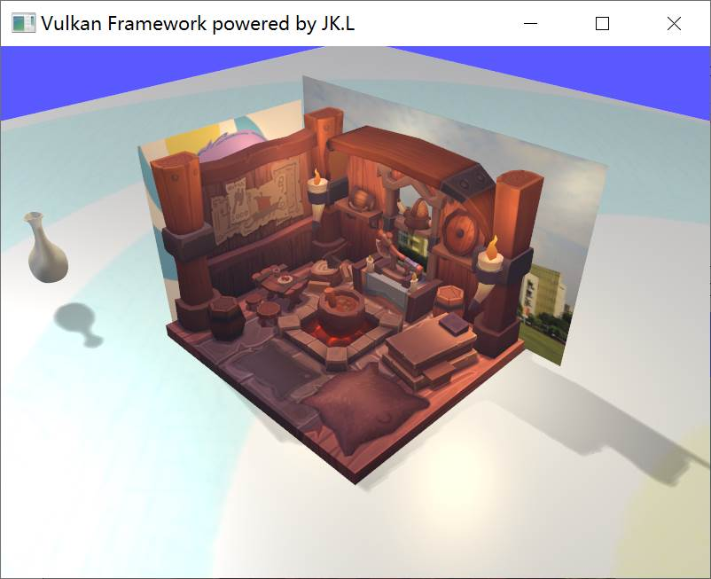
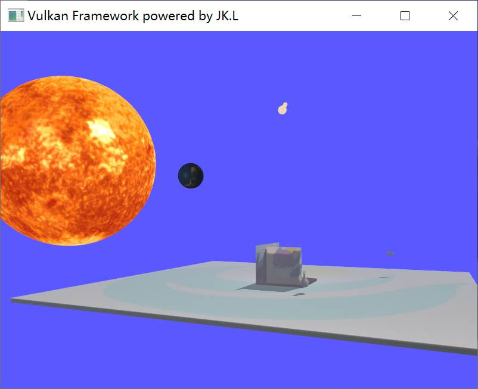
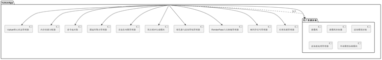
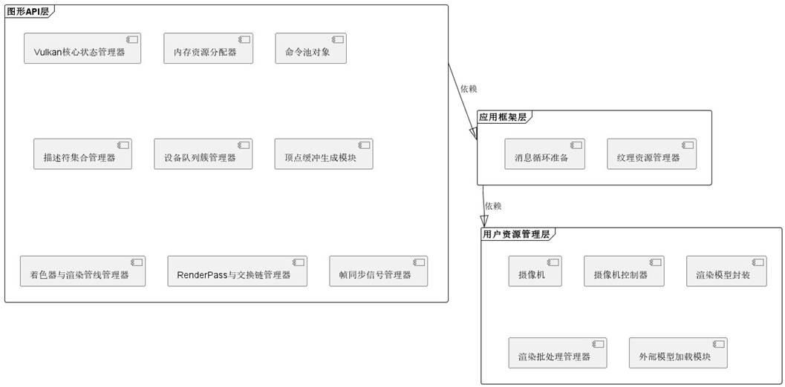
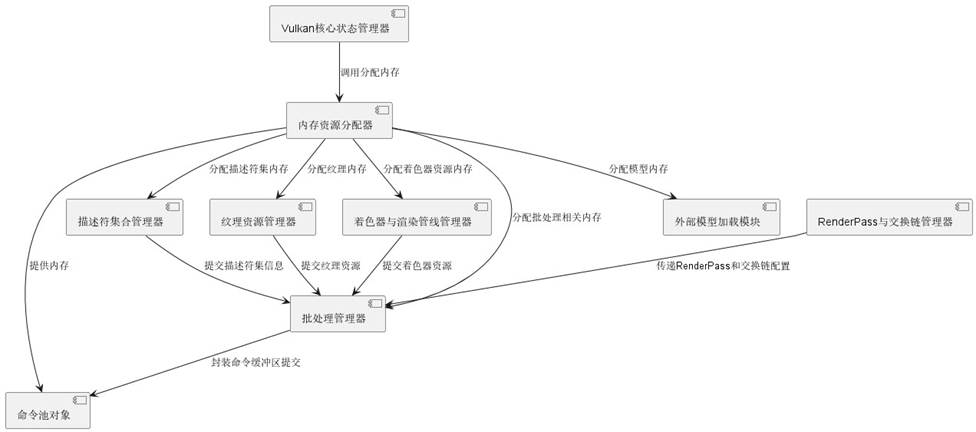
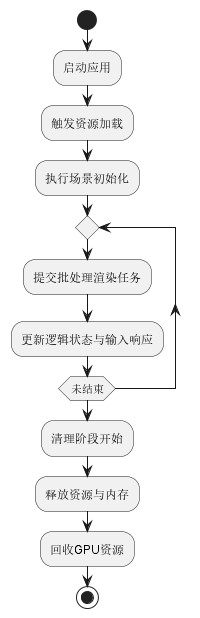

# JK-Toy-Vulkan
A toy render system written in vulkan, made for my computer graphics course project at university.

---

## 简介

SCU 2023-2024 计算机图形学 课程大作业

> 基于Vulkan的简易光栅化实时渲染系统

~~名字味道太冲了~~

项目实现主要参考了

[vulkan](https://vulkan-tutorial.com/)、[littleVulkanEngine](https://github.com/blurrypiano/littleVulkanEngine)、[toy2d](https://github.com/VisualGMQ/toy2d)、[vulkan-examples](https://github.com/SaschaWillems/Vulkan)。

## 概述

本项目基于现代图形API（Vulkan）及着色器编程，实现了一个具备简易渲染步骤管理的基础实时光栅化系统。该系统框架的主要特性包括：清晰的渲染流程框架和接口抽象、基于资源池的全局内存管理、多渲染通道（Render Pass）支持、可修改性良好的渲染管线管理、基于批处理的渲染任务创建、完善的渲染物体封装（矩阵变换、光照材质）、易用性良好的摄像机封装、纹理资源管理与纹理映射、基于第三方库的模型（.obj）文件读取、基础建模算法支持（Cube、Sphere、Plane）。

在此框架之下，通过着色器编程，实现了最终的展示demo。该demo支持：Blinn-Phong光照模型下的多光源（点光源、平行光源）与阴影映射、基于PCF滤波和泊松圆盘采样的软阴影、基于距离平方衰减的雾化效果；demo完整展示了上述功能用户可视部分，同时展示了复合模型变换下的动画效果。

主要运行界面展示如下：

## 编译环境

> 平台：Windows 10 家庭中文版 64位 22H2 
>
> 框架：
>
> - MSYS2 toolchain
>
> - Vulkan C SDK
>
> - GLFW
>
> - GLM
>
> - RapidOBJ
>
> - STB_IMAGE
>
> 语言：C++ 17；GLSL 4.5

项目使用cmake组织。

## 设计

## 碎碎念

（上述部分摘自我的课程报告，其中虚实几分不言而喻）

从9月开学动工，断断续续，到12月中旬进入密集开发和调试阶段。起初我完全未预料到Vulkan的学习曲线之陡峭——更别提我其实连一门其它图形API都未尝真正掌握过。知乎上有言论“现在的初学者应该一开始就接受现代图形API的规范”；现在来看，这种说辞有待推敲。

直到第一次课程作业结束，我才堪堪跟着全网唯一的一册Vulkan tutorial step by step解决了三角形的绘制，在各种物理设备、逻辑设备、交换链、命令队列、命令缓存、帧间信号量同步、奇怪的staging缓存方法中捉摸不清，到如今虽然对这些概念终于不陌生了，然而详述起来仍然需要翻阅厚厚的API Guide。

Vulkan tutorial仅仅是展示了能够完成一项工作的最小实现方法，两三千行教学代码简单地塞在一个文件；为了让Vulkan在我手里可用，我只能不断大刀阔斧重构积累的代码。不得不提，Vulkan examples比Vulkan tutorial好就好在进行了基础且恰当的重复劳动封装，每个示例都能露出一条清晰的思维逻辑。

在实际开发中，遭遇了许多吊诡的情况，比如：在GDB下运行正常，脱离GDB就会出现概率性的错误模型变换——而解决方法竟然是转移了几处函数的位置；还有各种着色器数据传递内存对齐问题。在整个项目开发中，实际耗费了大量的时间在资源和流程管理、需求后更新各组件不断重构、参数调整之上，而真正用于应用图形学基础知识的地方对比起来已经十分轻松。MVP三板斧后，剩下的就是着色器代码编写了。

整个项目最后封装下来也算堪堪能用。但是渲染批处理那一块的封装实现完全是废步骤，还不如简单地将所有渲染物件依次record到command buffer上来得好。都怪gpt瞎给我提意见，代码还是靠我自己写的，结果根本没起到啥优势，还不方便做透明度排序，丢了一组加分项（气）。这方面，我要表扬一下国产通义千问，最近的使用体验比gpt3.5好太多了（怒）。

以及我的展示demo中地球绕太阳的公转方向好像反了，不过无伤大雅（？）
